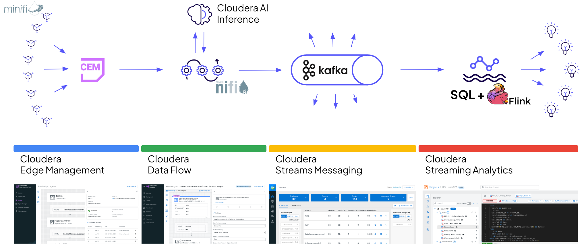

# PI Systems 2 AI — Hands on Lab

## Bienvenido

En este laboratorio práctico construirás un **pipeline completo de analítica en tiempo real** utilizando datos de medidores eléctricos de plantas de generación del Instituto Costarricense de Electricidad (ICE).

El pipeline replica una arquitectura empresarial de *Data in Motion* de extremo a extremo: desde la telemetría del borde (edge) hasta el almacenamiento analítico y la visualización.

---

## Componentes del Lab

| Componente | Rol en el pipeline |
|---|---|
| **Mosquitto MQTT** | Broker del edge — recibe telemetría eléctrica simulada |
| **Apache NiFi (CDF-K)** | Ingesta y enrutamiento de datos hacia Kafka |
| **Schema Registry** | Validación y versionado del schema Avro |
| **Apache Kafka** | Bus de mensajería en tiempo real |
| **Apache Flink / SSB** | Procesamiento y enriquecimiento del stream |
| **Apache Kudu** | Almacén analítico de baja latencia |

---

## Selecciona tu usuario

Ingresa tu usuario asignado para que todos los comandos y queries se actualicen automáticamente en la guía:

  

    <select id="user-number-input">
      <option value="">-- Selecciona tu usuario --</option>
    </select>
    <button id="user-username-save">Guardar</button>
    <button id="user-username-clear">Limpiar</button>
  

  

    <h3>Usuario activo: Ninguno</h3>
  

!!! tip "Tip"
    Una vez que selecciones tu usuario y presiones **Guardar**, todos los bloques de código a lo largo de la guía usarán tu usuario automáticamente.

---

## Duración y Agenda

| Tiempo | Actividad |
|---|---|
| 00:00 – 00:15 | Introducción y configuración del entorno |
| 00:15 – 00:45 | Schema Registry y creación del Kafka Topic |
| 00:45 – 01:30 | Apache NiFi — deploy y verificación del flujo |
| 01:30 – 01:50 | Kudu — creación de tablas |
| 01:50 – 02:30 | SQL Stream Builder — jobs de enriquecimiento |
| 02:30 – 03:00 | Verificación, visualización y Q&A |

---

## Plantas de ICE incluidas en el lab

| meter_id | Planta | Tipo | Región |
|---|---|---|---|
| CR-ICE-REV-001 | Reventazón | Hidroeléctrica | Caribe |
| CR-ICE-ARE-002 | Arenal | Hidroeléctrica | Huetar Norte |
| CR-ICE-CAC-003 | Cachí | Hidroeléctrica | Central |
| CR-ICE-TEJ-004 | Tejona | Eólica | Guanacaste |
