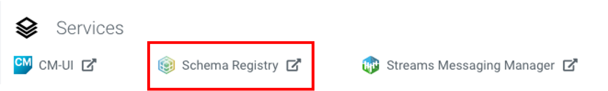
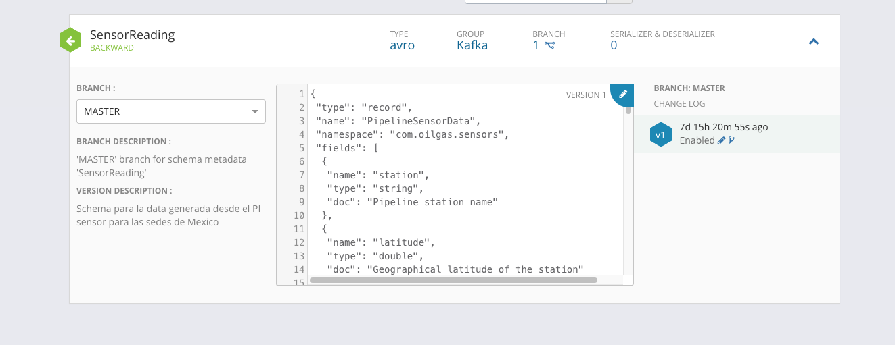
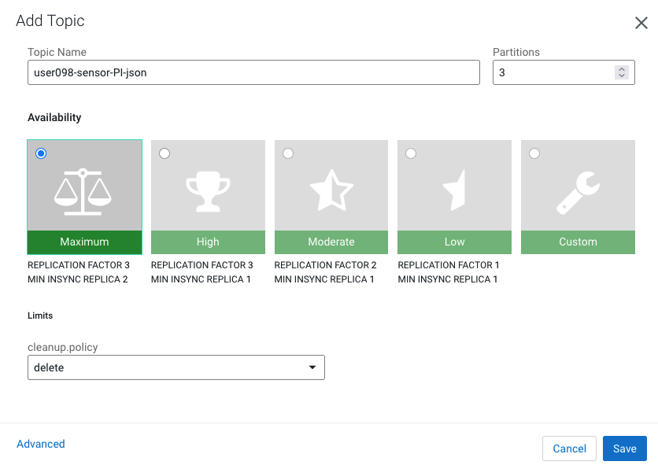

# Schema Registry y Kafka 📋

## Cloudera Schema Registry

El Schema Registry gestiona y versiona los schemas de los datos que fluyen por Kafka. Actúa como un "contrato" entre productores (NiFi) y consumidores (SSB/Flink), garantizando consistencia y compatibilidad.

### Paso 1 — Acceder al Schema Registry

Navega al **Streams Messaging DataHub** → Quick Links → **Schema Registry**.



Inicia sesión con tu usuario y el Workload Password configurado anteriormente.

---

### Paso 2 — Crear el schema

Haz clic en **+ New Schema** (esquina superior derecha) y completa el formulario:

| Campo | Valor |
|---|---|
| **Name** | `USERNAME-SensorReading` |
| **Description** | Sensor schema for dataflow workshop |
| **Type** | Avro schema provider |
| **Schema Group** | Kafka |
| **Compatibility** | Backward |
| **Evolve** | True |

!!! warning "Importante"
    El nombre del schema (`USERNAME-SensorReading`) debe coincidir **exactamente** con el nombre del Kafka topic que crearás a continuación. Una discrepancia causará errores `SchemaNotFoundException` en NiFi.

---

### Paso 3 — Ingresar el Schema Text (Avro)



Pega el siguiente schema en el campo **Schema Text**:

```json
{
  "type": "record",
  "name": "ElectricMeterEvent",
  "namespace": "com.energy.meters",
  "fields": [
    { "name": "meter_id",    "type": "string" },
    { "name": "site",        "type": "string" },
    { "name": "location",    "type": {
        "type": "record", "name": "GeoLocation",
        "fields": [
          { "name": "latitude",  "type": "double" },
          { "name": "longitude", "type": "double" }
        ]}},
    { "name": "ts_epoch_ms", "type": "long"   },
    { "name": "ts_iso",      "type": "string" },
    { "name": "electrical",  "type": {
        "type": "record", "name": "ElectricalReadings",
        "fields": [
          { "name": "voltage_v",             "type": "double" },
          { "name": "current_a",             "type": "double" },
          { "name": "frequency_hz",          "type": "double" },
          { "name": "power_factor",          "type": "double" },
          { "name": "active_power_kw",       "type": "double" },
          { "name": "reactive_power_kvar",   "type": "double" },
          { "name": "apparent_power_kva",    "type": "double" },
          { "name": "energy_kwh_cumulative", "type": "double" }
        ]}},
    { "name": "anomaly", "type": ["null","string"], "default": null }
  ]
}
```

Haz clic en **Save** para registrar el schema.

---

## Kafka Topic

### Paso 4 — Abrir Streams Messaging Manager

Desde el Streams Messaging DataHub → Quick Links → **Streams Messaging Manager (SMM)**:


---

### Paso 5 — Crear el topic

En el panel izquierdo haz clic en **Topics** → **+ Create Topic**:

| Campo | Valor |
|---|---|
| **Name** | `USERNAME-sensor-PI-json` |
| **Partitions** | `3` |
| **Replication Factor** | `3` |



!!! tip "Tip"
    El nombre del topic debe seguir el mismo patrón de usuario que el schema. Usa el selector de usuario en la página de inicio para que los bloques de código se auto-completen.
