# SQL Stream Builder 🦃

SQL Stream Builder (SSB) permite ejecutar queries SQL sobre streams de datos en tiempo real usando Apache Flink como motor de procesamiento.

---

## 5. Registrar Kafka Data Source

Las Virtual Tables se crean automáticamente desde los schemas del Schema Registry.

### Paso 1 — Crear la Virtual Table

Ve a **Virtual Tables** → **New Kafka Table**:

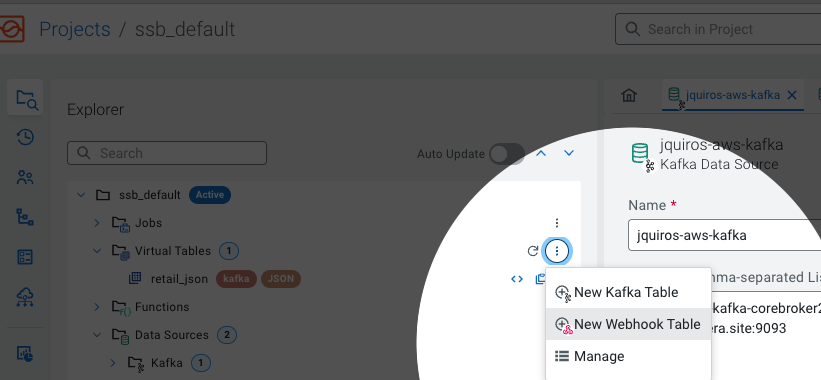

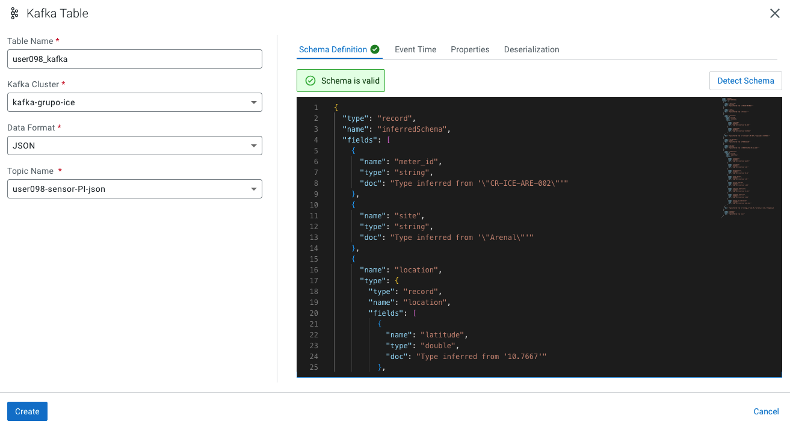

Asigna el nombre de la tabla incluyendo tu user_id:

```
USERNAME_kafka
```

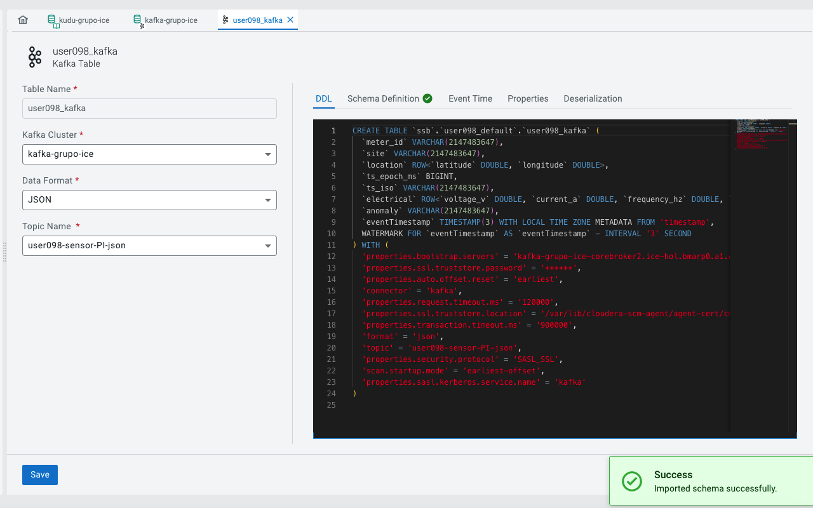

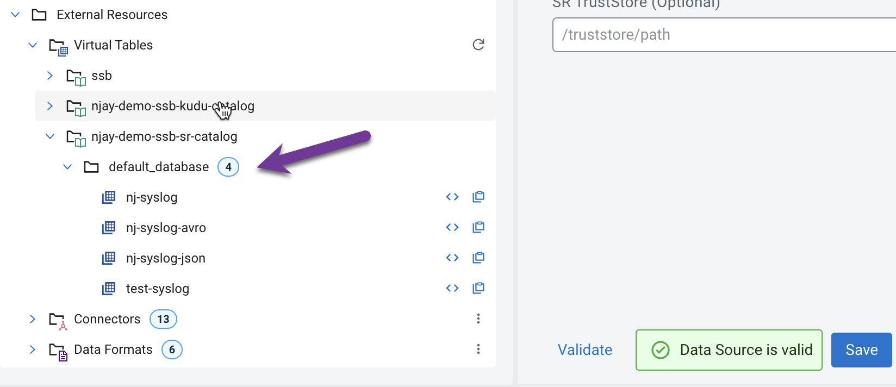

!!! warning "Importante"
    El nombre del topic en Kafka debe coincidir con el schema asociado en el Schema Registry.

---

## 6. Registrar Kudu Catalog

Un Kudu Catalog hace que todas las tablas de Kudu estén disponibles para queries SQL en SSB automáticamente.

### Paso 1 — Verificar permisos en Ranger

Antes de registrar el catalog, verifica que tu usuario tenga permisos en Ranger UI → Audits.

### Paso 2 — Crear el Catalog

En **Data Sources** → **Catalog** → **New Catalog**:

| Campo | Valor |
|---|---|
| **Name** | `dh-kudu` |
| **Catalog Type** | Kudu |
| **Kudu Masters** | `{{ kudu_masters }}` |

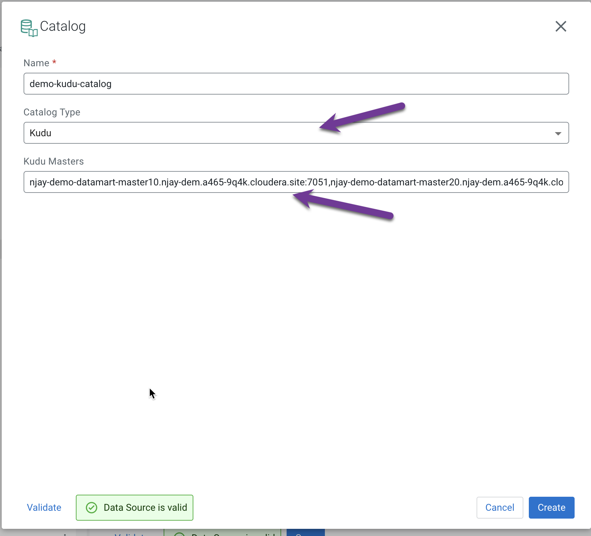

Los hostnames de los Kudu Masters se encuentran en el CDP Console → Real-time Data Mart → Nodes:

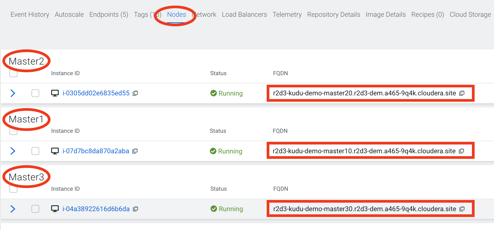

### Paso 3 — Validar y crear

Haz clic en **Validate**. Si es exitoso, verás el número de tablas descubiertas:

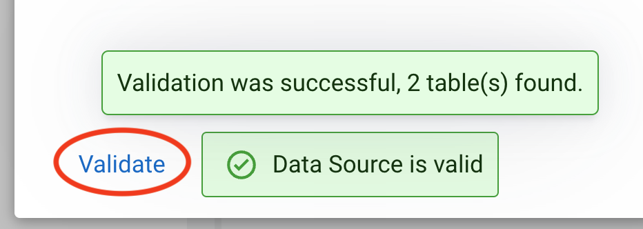

Haz clic en **Create**:

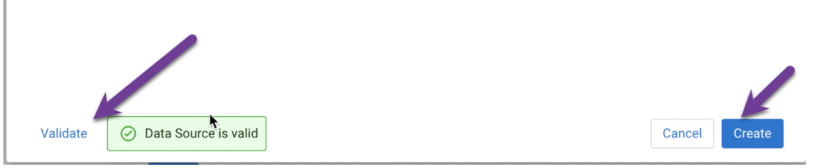

Explora las tablas en **External Resources** → **Virtual Tables**:

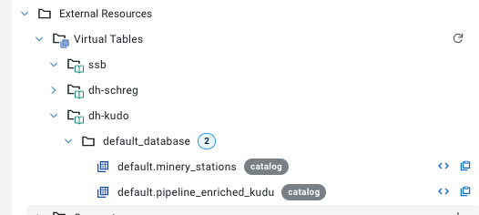

---

## 7. Desbloquear Keytab 🔐

Antes de ejecutar jobs, debes desbloquear tu keytab para que Flink se autentique con los servicios del clúster.

### Paso 1 — Ir a Manage Keytab

Haz clic en tu usuario → **Manage Keytab**:

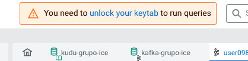

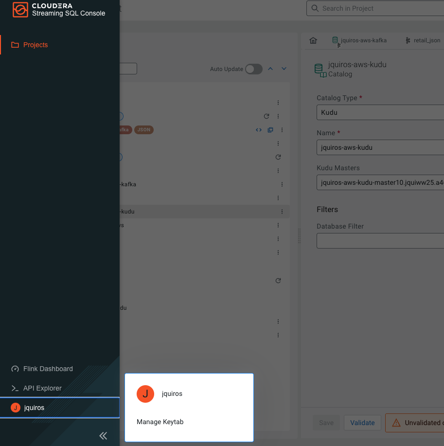

### Paso 2 — Desbloquear

Ingresa tu usuario y Workload Password → **Unlock Keytab**:

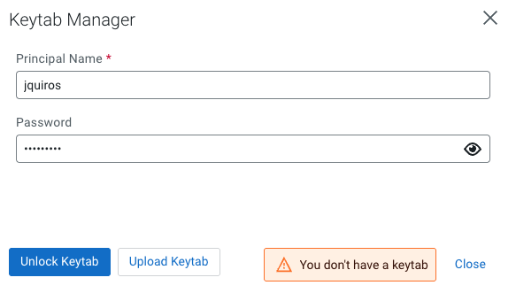

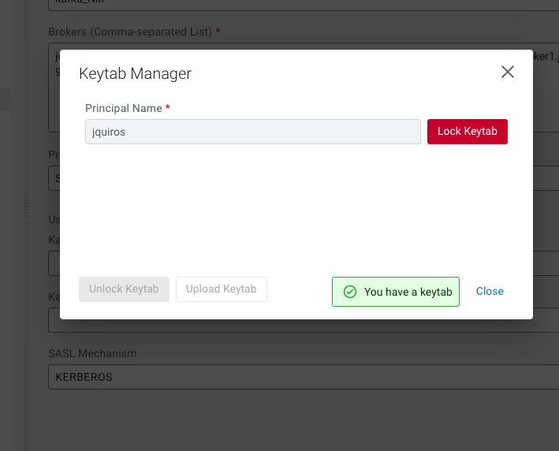

---

## 8. Crear el Streaming SQL Job 📣

### Paso 1 — Nuevo Job

En el panel de navegación, kebab menu → **New Job** → nombre: `job1`:

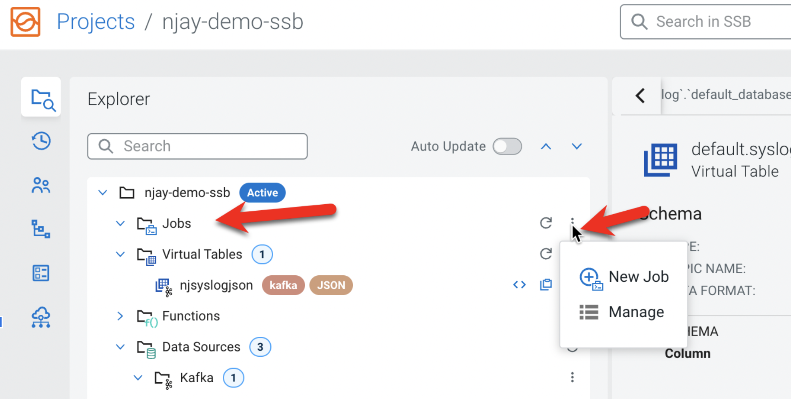

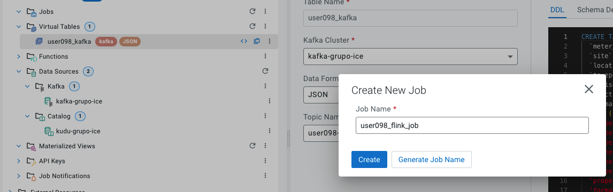

### Paso 2 — SQL Editor

El SQL Editor es tu entorno para componer queries sobre streams en tiempo real:

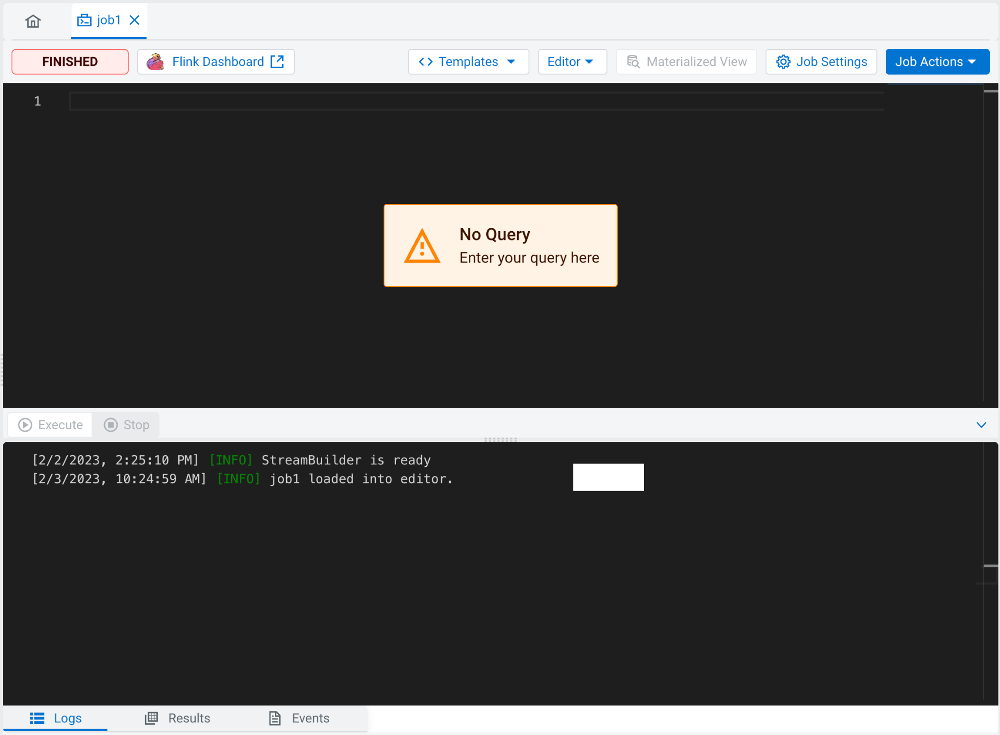

### Paso 3 — Ejecutar el query de enriquecimiento

Este query hace un JOIN en tiempo real entre el stream de Kafka y la tabla de referencia de Kudu, calculando también la distancia geográfica entre la lectura y la ubicación registrada del medidor:

```sql
INSERT INTO `kudu-grupo-ice`.`default`.`default.USERNAME_electric_meter_enriched_kudu`
SELECT
  TO_TIMESTAMP_LTZ(e.ts_epoch_ms, 3)        AS event_time,
  e.meter_id,
  e.site,
  e.location.latitude                        AS latitude,
  e.location.longitude                       AS longitude,
  e.electrical.voltage_v                     AS voltage_v,
  e.electrical.current_a                     AS current_a,
  e.electrical.frequency_hz                  AS frequency_hz,
  e.electrical.power_factor                  AS power_factor,
  e.electrical.active_power_kw               AS active_power_kw,
  e.electrical.reactive_power_kvar           AS reactive_power_kvar,
  e.electrical.apparent_power_kva            AS apparent_power_kva,
  e.electrical.energy_kwh_cumulative         AS energy_kwh_cumulative,
  e.anomaly,
  d.utility_provider,
  d.voltage_level,
  d.installation_year,
  d.region,
  d.status                                   AS meter_status,
  ( 6371 * ACOS(
      COS(RADIANS(e.location.latitude)) *
      COS(RADIANS(d.latitude)) *
      COS(RADIANS(d.longitude) - RADIANS(e.location.longitude)) +
      SIN(RADIANS(e.location.latitude)) *
      SIN(RADIANS(d.latitude))
  ))                                          AS distance
FROM USERNAME_kafka e
INNER JOIN `kudu-grupo-ice`.`default`.`default.USERNAME_electric_meter_sites` d
  ON e.meter_id = d.meter_id;
```

Si el job funciona correctamente, verás un mensaje de éxito:

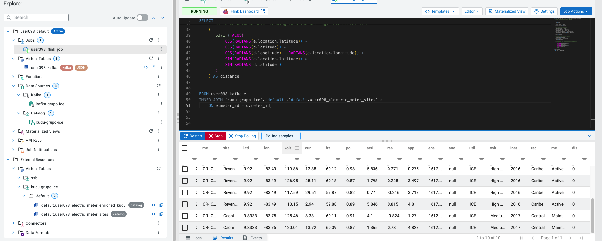

### Paso 4 — Verificar datos en Kudu

Navega al Kudu DataHub → **Data Explorer**:

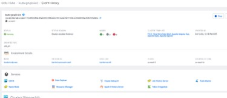

O ejecuta en Hue:

```sql
SELECT * FROM `default`.`USERNAME_electric_meter_enriched_kudu` LIMIT 100;
```

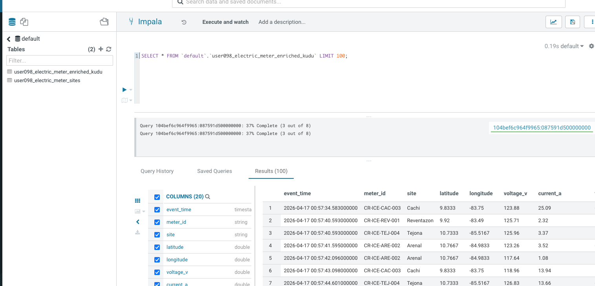

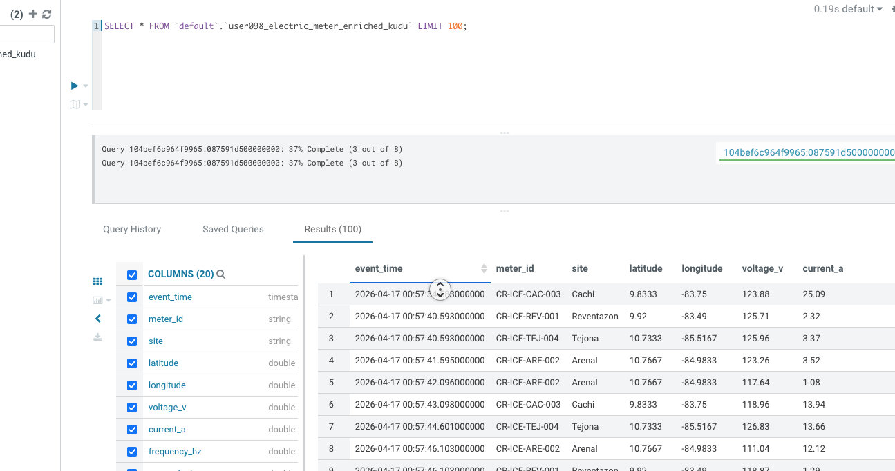

---

## ¿Qué sigue?

Ahora que tienes el pipeline funcionando, puedes conectar cualquier herramienta de BI para visualizar los datos en tiempo real:

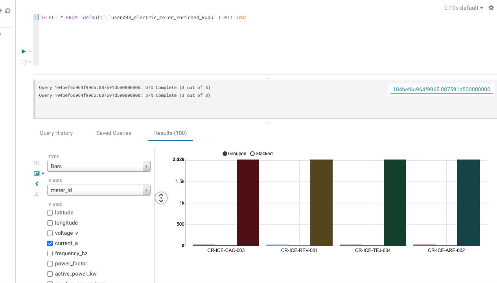

!!! success "¡Felicitaciones — Let's Gooooo0000ooo! 🎉"
    El pipeline de extremo a extremo está funcionando:

    **MQTT → NiFi → Kafka → Flink/SSB → Kudu**

    Los datos fluyen en tiempo real desde las plantas de ICE hasta el almacén analítico.
    Conecta Cloudera Data Visualization, Tableau o Power BI a la tabla Kudu para crear dashboards de monitoreo eléctrico.
